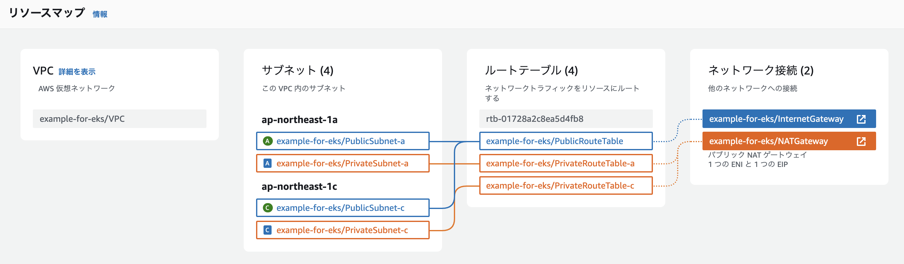

# EKS 練習用の VPC & 関連リソース 作成
このTerraformプロジェクトは、EKSクラスター用のVPCや関連リソースを事前に作成するためのものです。  
学習目的で設計されており、実運用向けの設定は含まれていません。


## 作成されるもの
以下の リソース が作成されます。

- ネットワーク関係
  - VPC
  - Subnet(public/private)
  - Route Table
  - Internet Gateway
  - NAT Gateway
  - SecurityGroup(sg)
    - EKS Node に設定するための sg
      - 外部の sg に設定する識別子として利用
    - RDS に設定するための sg
      - Node --> RDS を許可する
- データベース関係
  - RDS
    - RDS Cluster & Instance (1台)
    - Subnet Group
  - Secret Manager
    - MySQL admin パスワード保管用


### ネットワーク関係詳細


| 名前                          | サブネットのタイプ     | AZ                | CIDRブロック      | IPアドレス範囲                | IPアドレス数 |
|------------------------------|-----------------------|-------------------|-------------------|------------------------------|--------------|
| example-for-eks/PublicSubnet-a | パブリックサブネット   | ap-northeast-1a   | 172.20.0.0/19     | 172.20.0.0 - 172.20.31.255    | 8,192        |
| example-for-eks/PrivateSubnet-a | プライベートサブネット | ap-northeast-1a   | 172.20.96.0/19    | 172.20.96.0 - 172.20.127.255  | 8,192        |
| example-for-eks/PublicSubnet-c | パブリックサブネット   | ap-northeast-1c   | 172.20.32.0/19    | 172.20.32.0 - 172.20.63.255   | 8,192        |
| example-for-eks/PrivateSubnet-c | プライベートサブネット | ap-northeast-1c   | 172.20.128.0/19   | 172.20.128.0 - 172.20.159.255 | 8,192        |


### AWS の料金
作成されるAWSリソースのうち以下のリソースには起動している時間の分だけ料金が発生します。

- NAT Gateway
  - 0.062 USD / hour (*1)
- RDS
  - 0.125 USD / hour (*1)
- Secret Manager
  - シークレットひとつあたり USD 0.40 / month (*2)

他にも通信量によって課金されます。詳しくは以下を確認してください。

- [料金 - Amazon VPC | AWS](https://aws.amazon.com/jp/vpc/pricing/)
- [料金 \- AWS Secrets Manager \| AWS](https://aws.amazon.com/jp/secrets-manager/pricing/)
- [料金 \- Amazon RDS \| AWS](https://aws.amazon.com/jp/rds/pricing/)

*1) アジアパシフィック（東京）で計算しています(2024/08/23現在)  
*2) SecretManager は1ヶ月未満の場合時間単位で課金されるので仮に1週間(168時間)放置しても 0.09 USD です


## 初期設定
### Terraform 初期化
Terraformの初期化を行います。
```sh
terraform init
```

### AWSプロファイルを指定
特定のAWSプロファイルを使用する場合は、以下のように環境変数`AWS_PROFILE`を指定してコマンドを実行してください。

```sh
AWS_PROFILE=admin terraform apply
```
同様に、`plan` や `destroy` の際も `AWS_PROFILE=admin` を付けて実行できます。


毎回指定するのが面倒な場合は、以下で環境変数を設定してください。
```sh
export AWS_PROFILE=admin
```
適宜設定してください

## 操作
### 設定の確認
リソースの作成前に、どのような変更が行われるかを確認できます。
```sh
terraform plan
```

各リソースの接頭辞を変更したい場合は以下のようにします。
```sh
terraform plan -var='project_name=sample'
```

### リソースの作成
以下のコマンドでリソースを作成します。

```sh
terraform apply
```

`terraform plan` と同様で `-var` を指定することで接頭辞を変更できます。
```sh
terraform apply -var='project_name=sample'
```

### リソースの削除
作成したリソースを削除するには、次のコマンドを使用します。

```sh
terraform destroy
```


## 実行例
```
❯ terraform apply

Terraform used the selected providers to generate the following execution plan. Resource actions are indicated
with the following symbols:
  + create

...省略

Apply complete! Resources: 17 added, 0 changed, 0 destroyed.

Outputs:

gateways = {
  "igw" = {
    "id" = "igw-09c79ae99561ce92e"
  }
  "nat" = {
    "allocation_id" = "eipalloc-06a9fd703bd3b37e8"
    "eip" = "18.180.39.18"
    "id" = "nat-095d381e2aacfdbce"
    "subnet_id" = "subnet-0530108ae4bf7e25f"
  }
}
rds = {
  "cluster_identifier" = "example-for-eks"
  "endpoint" = "example-for-eks.cluster-abcdefghij12.ap-northeast-1.rds.amazonaws.com"
}
route_tables = {
  "private" = {
    "a" = {
      "id" = "rtb-01277811b441483cc"
    }
    "c" = {
      "id" = "rtb-03fd1963090584902"
    }
  }
  "public" = {
    "id" = "rtb-0b7c6c1b7d74ed6c1"
  }
}
security_groups = {
  "worker_node" = {
    "id" = "sg-01f7fb5c490e1e321"
  }
  "rds" = {
    "id" = "sg-0cb0a347fdd4b4dcd"
  }
}
subnet = {
  "private" = {
    "a" = "subnet-0afed2d9ca0618292"
    "c" = "subnet-048785d9bddde51fc"
  }
  "public" = {
    "a" = "subnet-0530108ae4bf7e25f"
    "c" = "subnet-0306db4cc0c51eef8"
  }
}
vpc_id = "vpc-05e06efc4522bd55e"
```


上記の実行結果を、 [eksctl](https://eksctl.io/usage/creating-and-managing-clusters/) で利用する `cluster.yaml ` に指定した例
```yaml
apiVersion: eksctl.io/v1alpha5
kind: ClusterConfig
metadata:
  name: webapp
  region: ap-northeast-1
  version: "1.30"
vpc:
  id: vpc-05e06efc4522bd55e
  subnets:
    private:
      ap-northeast-a:
        id: subnet-0afed2d9ca0618292
      ap-northeast-c:
        id: subnet-048785d9bddde51fc
    public:
      ap-northeast-a:
        id: subnet-0530108ae4bf7e25f
      ap-northeast-c:
        id: subnet-0306db4cc0c51eef8
managedNodeGroups:
  - name: workers
    instanceType: t3.medium
    desiredCapacity: 2
    minSize: 2
    maxSize: 5
    securityGroups:
      attachIDs: ["sg-01f7fb5c490e1e321"]
```

## 料金をなるべく押さえるために
有料リソースはなるべく停止しておきたいという方のためにモジュール単位で作成・削除できるようにしました。  
以下の手順のように行うとコストを最低限にしつつ学習を進められます。

### 1. 全てのリソースを作成
最初は全てのリソースを作成します。

```sh
terraform apply
```
全てのリソースを作成するのに大体8分ほどかかります。

### 2. 有料のリソースだけを削除
NAT Gateway と RDS は起動している間料金が発生するので、削除します。

※ DB の内容も全て削除します。

```sh
terraform destroy -target=module.nat_gateway -target=module.rds
```
RDS の削除は15分ほどかかります。


### 3. 有料のリソースを起動
2 で削除したリソースを再度作成します。

```sh
terraform apply -target=module.nat_gateway -target=module.rds
```
再作成したので、DB の内容はまっさらな状態です。改めて `CREATE DATABASE` や `CREATE TABLE` を行ってください。


### RDS を使わない場合
RDS が不要な場合は、以下のようにすると VPC や NAT Gateway などネットワーク関連のリソースのみ作成できます。

```sh
terraform apply -target=module.vpc -target=module.nat_gateway
```


## 免責事項
このTerraformプロジェクトおよび関連資料は学習目的で提供されており、使用に際しての正確性、信頼性、適用性についていかなる保証も行いません。本プロジェクトを使用することで発生した問題や損害については、一切の責任を負いかねますのでご了承ください。

また、AWS等のクラウドサービスを利用する場合、その利用に伴う料金が発生する可能性があり、これに関連する費用はユーザーの責任で管理してください。必ず最新の料金体系や使用量を確認し、不要なリソースは速やかに削除するなどの適切な管理を行ってください。

最後に、このリポジトリ内のコードやドキュメントを使用する前に、必ず自身の環境に適した内容であるか確認し、必要に応じて調整を行ってください。


## LICENSE
Apache License 2.0

