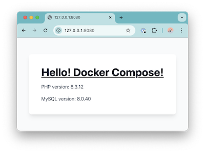

# nginx + php-fpm + mysql の web アプリ

コンテナで動くサンプル用の Web アプリケーションです。



```
+-----------+      +-----------+      +---------+
| webserver | <--> |    app    | <--> |   db    |
|  (nginx)  |      | (php-fpm) |      | (mysql) |
+-----------+      +-----------+      +---------+
```

※ webserver <---> app のやり取りは UNIX ドメインソケットを使用

## 構造

```
tree
.
├── README.md
├── compose.yaml                       # docker compose のためのファイル
├── docker                             # docker: コンテナイメージを作成するために必要なファイルを配置
│   ├── nginx                          # nginx: nginxイメージのためのファイルを配置
│   │   ├── Dockerfile
│   │   └── conf
│   │       ├── conf.d
│   │       │   ├── default.conf
│   │       │   └── upstream.conf
│   │       └── nginx.conf
│   └── php-fpm                        # php-fpm: php-fpmイメージのためのファイルを配置
│       ├── Dockerfile
│       └── conf
│           └── php-fpm.d
│               └── zz-docker.conf
└── src                                # src: ソースコードを配置
    ├── app                            # app: エントリーポイントのphpから読み込まれるphpを配置
    │   ├── app.php
    │   └── template
    │       └── index.tpl.php
    └── public                         # public: ドキュメントルートにするディレクトリ
        └── index.php                  # エントリーポイントになるphp

12 directories, 11 files
```

## コンテナイメージのビルド方法

```sh
cd sample-webapp-php
```

```sh
docker compose build
```

結果

```
docker image ls | grep -E '^webapp-|^REPOSITORY'
REPOSITORY                          TAG        IMAGE ID       CREATED          SIZE
webapp-nginx                        latest     1079966c89c7   24 minutes ago   43.5MB
webapp-php                          latest     b44ced50d28c   24 minutes ago   78.2MB
```

minikube にイメージを読み込ませる

```
minikube image load webapp-nginx:v0.1.0
minikube image load webapp-php:v0.1.0
# minikubeのイメージの一覧を確認
minikube image ls
```

### 変数を指定してビルド

```sh
TAG=v0.1.0 docker compose build
```

```sh
REGISTRY_HOST=123456789012.dkr.ecr.ap-northeast-1.amazonaws.com docker compose build
```

### サービスを指定してビルド

```sh
docker compose build webserver
```

```sh
docker compose build app
```

## 起動 / 停止

### 起動

```sh
docker compose up -d
```

```
docker compose ps
NAME                            IMAGE                 COMMAND                   SERVICE     CREATED          STATUS                    PORTS
sample-webapp-php-app-1         webapp-php:latest     "docker-php-entrypoi…"   app         33 seconds ago   Up 26 seconds (healthy)   9000/tcp
sample-webapp-php-db-1          mysql:8.0             "docker-entrypoint.s…"   db          33 seconds ago   Up 32 seconds (healthy)   3306/tcp, 33060/tcp
sample-webapp-php-webserver-1   webapp-nginx:latest   "/docker-entrypoint.…"   webserver   33 seconds ago   Up 21 seconds             0.0.0.0:8080->80/tcp
```

[http://127.0.0.1:8080](http://127.0.0.1:8080) へアクセスすると HTML コンテンツがレスポンスされる

```
curl -i http://127.0.0.1:8080
HTTP/1.1 200 OK
Server: nginx/1.25.3
Date: Thu, 15 Aug 2024 23:57:15 GMT
Content-Type: text/html; charset=UTF-8
Transfer-Encoding: chunked
Connection: keep-alive
X-Powered-By: PHP/8.3.10

<!doctype html>
<html lang="ja">
<head>
  <meta charset="UTF-8">
  <meta name="viewport" content="width=device-width, initial-scale=1.0">
  <script src="https://cdn.tailwindcss.com/3.0.0"></script>
</head>
<body class="bg-gray-50 flex items-center justify-center min-h-screen">
  <div class="bg-white p-10 rounded-lg shadow-lg">
    <h1 class="text-4xl font-bold underline text-gray-900">Hello! Docker Compose!</h1>
    <p class="mt-4 text-gray-600">PHP version: 8.3.10</p>
    <p class="mt-4 text-gray-600">MySQL version: 8.0.39</p>
  </div>
</body>
</html>
```

### 停止

```sh
docker compose down
```

## Kubernetes で動かす場合

- manifest ファイルの適用

```
kubectl apply -f ./manifests
deployment.apps/webapp unchanged
horizontalpodautoscaler.autoscaling/webapp created
ingress.networking.k8s.io/webapp created
service/webapp created
```

- 適用されたリソースの確認

```
kubectl -n webapp-practice get all,ing
NAME                          READY   STATUS    RESTARTS   AGE
pod/webapp-7c8475b989-5t9x8   1/1     Running   0          6m38s
pod/webapp-7c8475b989-97c2b   1/1     Running   0          6m38s

NAME             TYPE        CLUSTER-IP       EXTERNAL-IP   PORT(S)   AGE
service/webapp   ClusterIP   10.107.201.134   <none>        80/TCP    5m58s

NAME                     READY   UP-TO-DATE   AVAILABLE   AGE
deployment.apps/webapp   2/2     2            2           6m38s

NAME                                DESIRED   CURRENT   READY   AGE
replicaset.apps/webapp-7c8475b989   2         2         2       6m38s

NAME                                         REFERENCE           TARGETS              MINPODS   MAXPODS   REPLICAS   AGE
horizontalpodautoscaler.autoscaling/webapp   Deployment/webapp   cpu: <unknown>/10%   2         10        2          5m58s

NAME                               CLASS   HOSTS   ADDRESS        PORTS   AGE
ingress.networking.k8s.io/webapp   nginx   *       192.168.49.2   80      5m58s
```

- うまく起動できなかった場合は？

```
kubectl -n webapp-practice describe <pod名>
```

でログを確認します

```
kubectl -n webapp-practice describe pod/webapp-7c8475b989-5t9x8
Name:             webapp-7c8475b989-5t9x8
Namespace:        webapp-practice
Priority:         0
Service Account:  default
Node:             minikube/192.168.49.2
Start Time:       Sun, 10 Aug 2025 10:32:48 +0900
Labels:           app=webapp
                  pod-template-hash=7c8475b989
Annotations:      <none>
Status:           Pending
IP:               10.244.0.8
IPs:
  IP:           10.244.0.8
Controlled By:  ReplicaSet/webapp-7c8475b989
Containers:
  webserver:
    Container ID:
    Image:          webapp-nginx:v0.1.0
    Image ID:
    Port:           <none>
    Host Port:      <none>
    State:          Waiting
      Reason:       ImagePullBackOff
    Ready:          False
    Restart Count:  0
    Limits:
      cpu:     100m
      memory:  32Mi
    Requests:
      cpu:        50m
      memory:     16Mi
    Environment:  <none>
    Mounts:
      /var/run/secrets/kubernetes.io/serviceaccount from kube-api-access-n997h (ro)
Conditions:
  Type                        Status
  PodReadyToStartContainers   True
  Initialized                 True
  Ready                       False
  ContainersReady             False
  PodScheduled                True
Volumes:
  kube-api-access-n997h:
    Type:                    Projected (a volume that contains injected data from multiple sources)
    TokenExpirationSeconds:  3607
    ConfigMapName:           kube-root-ca.crt
    ConfigMapOptional:       <nil>
    DownwardAPI:             true
QoS Class:                   Burstable
Node-Selectors:              <none>
Tolerations:                 node.kubernetes.io/not-ready:NoExecute op=Exists for 300s
                             node.kubernetes.io/unreachable:NoExecute op=Exists for 300s
Events:
  Type     Reason     Age                    From               Message
  ----     ------     ----                   ----               -------
  Normal   Scheduled  4m27s                  default-scheduler  Successfully assigned webapp-practice/webapp-7c8475b989-5t9x8 to minikube
  Normal   Pulling    2m38s (x4 over 4m26s)  kubelet            Pulling image "webapp-nginx:v0.1.0"
  Warning  Failed     2m35s (x4 over 4m19s)  kubelet            Failed to pull image "webapp-nginx:v0.1.0": Error response from daemon: pull access denied for webapp-nginx, repository does not exist or may require 'docker login': denied: requested access to the resource is denied
  Warning  Failed     2m35s (x4 over 4m19s)  kubelet            Error: ErrImagePull
  Warning  Failed     2m23s (x6 over 4m19s)  kubelet            Error: ImagePullBackOff
  Normal   BackOff    2m9s (x7 over 4m19s)   kubelet            Back-off pulling image "webapp-nginx:v0.1.0"
```

minikube 内にイメージがない場合は以下のコマンドを実行

```
TAG=v0.1.0 docker compose build
minikube image load webapp-nginx:v0.1.0
minikube image load webapp-php:v0.1.0
minikube image ls
registry.k8s.io/pause:3.9
registry.k8s.io/metrics-server/metrics-server:<none>
registry.k8s.io/kube-scheduler:v1.30.0
registry.k8s.io/kube-proxy:v1.30.0
registry.k8s.io/kube-controller-manager:v1.30.0
registry.k8s.io/kube-apiserver:v1.30.0
registry.k8s.io/ingress-nginx/kube-webhook-certgen:<none>
registry.k8s.io/ingress-nginx/controller:<none>
registry.k8s.io/etcd:3.5.12-0
registry.k8s.io/coredns/coredns:v1.11.1
gcr.io/k8s-minikube/storage-provisioner:v5
docker.io/library/webapp-php:v0.1.0
docker.io/library/webapp-nginx:v0.1.0
```

詳細は以下を参照してください。
[https://github.com/masa0221/sample-webapp-php-manifests](https://github.com/masa0221/sample-webapp-php-manifests)
